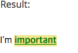

# ***Inheritance & Cascading***

## 1. 상속 inheritance
상속이란 상위(부모, 조상) 요소의 속성(property)을 하위(자식, 자손) 요소가 물려 받는 것을 의미한다. 상속 기능이 없다면 각 요소의 Rule set에 프로퍼티를 매번 각각 지정해야 한다.  
예를 들어, ```body```에 ```font-family``` 프로퍼티를 지정하면, 페이지 전체에 ```body```의 폰트가 적용된다. 모든 요소가 ```body```의 하위 요소이기 때문에다. 이는 상속의 대표적인 예이다.  

**하지만 모든 프로퍼티가 상속되는 것은 아니다. 프로퍼티 중에는 상속이 되는 것과 되지 않는 것이 있다.**
> 소프트웨어 공학에서는 효율의 측면에서 **중복**을 최소화하고자 노력한다. 그러한 관점에서 상속은 매우 유용한 개념이다.

상속 가능 여부에 대한 세부적인 확인은 [W3C - full property table](https://www.w3.org/TR/CSS21/propidx) 또는 [MDN CSS Reference](https://developer.mozilla.org/en-US/docs/Web/CSS/Reference)를 참조한다.  

간단히 짚고 넘어가보면, 

**크기 계열(box-sizing, layout 계열)은 대부분 상속되지 않는다.**
  * width/height
  * margin
  * padding
  * border
  * box-sizing
  * position/float/overflow
  * ...

**폰트, 색상 계열은 대부분 상속이 된다.**
  * font
  * color
  * line-height
  * text-align
  * ...

```html
<!DOCTYPE html>
<html>
<head>
  <meta charset="utf-8">
  <style>
    .text-red {
      color: red;
      border: 1px solid #bcbcbc;
      padding: 10px;
    }
  </style>
</head>
<body>
  <div class="text-red">
    <h1>Heading</h1>
    <p>Paragraph<strong>strong</strong></p>
    <button>Button</button>
  </div>
</body>
</html>
```

### 상속 제어

요소에 따라 상속을 받지 않는 것도 존재한다. (e.g. ```button``` 요소)

> 개발자 도구상에서 흐린 글씨로 나오는 것은 **상속이 되지 않는 속성(e.g. padding, border)**  이라는 의미이다.  

상속되지 않는 경우(상속받지 않는 요소 또는 상속되지 않는 프로퍼티)에 해당 요소나 프로퍼티에 ```inherit``` value를 주어 명시적으로 상속받게 할 수 있다.  

이처럼 CSS는 상속을 제어하는 값을 제공한다.
|Value|Description|
|:----|:----------|
|inherit|부모 요소의 속성 값으로 설정한다.|
|initial|브라우저의 기본 스타일 시트에 설정된 값으로 설정한다.|
|unset| 위 둘을 합친 것이다. 원래 값으로 재설정(reset)한다. 속성을 부모로부터 상속받은 경우라면, 상속 받은 값으로 재설정하고(inherit처럼), 그렇지 않은 경우라면 initial처럼 브라우저 초기값으로 재설정한다.|

```html
<!DOCTYPE html>
<html>
<head>
  <meta charset="utf-8">
  <style>
    .text-red {
      color: red;
      border: 1px solid #bcbcbc;
      padding: 10px;
    }
    .text-red button {
      color: inherit;
    }
    .text-red p {
      border: inherit;
      padding: inherit;
    }
  </style>
</head>
<body>
  <div class="text-red">
    <h1>Heading</h1>
    <p>Paragraph<strong>strong</strong></p>
    <button>Button</button>
  </div>
</body>
</html>
```


## 2. 캐스캐이딩(Cascading)
요소는 하나 이상의 CSS 선언에 영향을 받을 수 있다. 이때 충돌을 피하기 위해 **CSS 적용 우선순위**가 필요한데, 이를 **캐스캐이딩(Cascading Order)** 이라고 한다. 캐스캐이딩 규칙으로 다음 세 가지가 있다. (중요한 순으로 나열되어 있다.)

---

1) 중요도 Importance  
CSS가 **어디에 선언 되었는지**에 따라 우선 순위가 달라진다.  

2) 명시도 Specificity  
**셀렉터를 얼마나 명확하게 썼는지, 얼마나 구체적인지를 나타낸다.**  

3) 선언 순서 Source order  
**선언된 순서**에 따른 우선 순위. 나중에 선언될수록 우선 적용된다.

---

<br>

### **1) 중요도** 
CSS가 선언된 위치에 따라 우선순위가 달라진다.
1. ```head``` 요소 내의 ```style``` 요소

```html
<head>
  <style>
    background-color: beige;
    /* 우선순위가 가장 높다. */
  </style>
</head>
<body>
</body>
```

2. ```head``` 요소 내의 ```style``` 요소 내의 ```@import```문
```html
<head>
   <style>
    @impoer "../css/style.css"
    @import url("https://fonts.googleapis.com/css?family=Titillium+Web");
  </style>
</head>
```

3. ```<link>```로 연결된 CSS파일
```html
<head>
  <link rel="stylesheet" href="style.css">
</head>
```
4. ```<link>```로 연결된 CSS파일 내의 ```@import```문
```html
<head>
  <link rel="stylesheet" href="style.css">
</head>
```
```css
/* style.css */

@import url("https://fonts.googleapis.com/css?family=Titillium+Web");

...
```
5. 브라우저 디폴트 스타일시트

<br>

### **2) 명시도** 

대상이 명확할수록 우선순위가 높아진다.

기본적으로 선택자(selector)가 얼마나 구체적인지를 나타내는 데, 매치되는 요소의 수(적을 수록 명시도가 높다.)가 그 척도이다. 클래스 선택자(e.g. ```.food```)는 태그 선택자(e.g. ```div```)보다 매치되는 요소의 수가 적고, 대상이 보다 명확하여 우선 순위가 더 높다. 물론 id 선택자는 클래스보다 더 높다. 대상이 유일(unique)하기 때문이다.

```!important > 인라인 스타일 > 아이디 선택자 > 클래스/속성/가상 선택자 > 태그 선택자 > 전체 선택자 > 상위 요소에 의해 상속된 속성```

```html
<!DOCTYPE html>
<html>
<head>
  <style>
    p        { color: red !important; }
    #thing   { color: blue; }

    div.food { color: chocolate; }
    .food    { color: green; }
    div      { color: orange; }
  </style>
</head>
<body>
  <p id="thing">Will be Red.</p>
  <!-- p태그보다  id선택자가 명시도가 더 높으므로, 우선 순위도 더 높다. 다만 p태그에 !important가 적용되어 결과적으로는 p태그의 스타일이 적용된다.-->
  <div class="food">Will be Chocolate.</div>
</body>
</html>
```

<br>

### **3) 선언 순서**
선언된 순서에 따라 나중 선언된 스타일이 우선 적용된다.
```html
<!DOCTYPE html>
<html>
<head>
  <style>
    p { color: blue; }
    p { color: red; }

    .red { color: red; }
    .blue { color: blue; }
  </style>
</head>
<body>
  <p>Will be RED.</p>
  <p class="blue red">Will be BLUE.</p>
  /* class 적용 순서에는 우선순위가 없다.
     따라서 blue red이든, red blue이든 같은 결과를 낸다.(blue가 적용된다.) */
</body>
</html>

```
<br>

### **[A note of rule mixing](https://developer.mozilla.org/en-US/docs/Learn/CSS/Introduction_to_CSS/Cascade_and_inheritance)**
캐스케이딩 규칙에서 명심할 것은, 우선 순위가 높은 style이 다른 style 위로 덮어 쓰는(override 되는) 것은 단순히 **속성 수준(property-level)** 에서만 이루어진다는 것이다. 우선 적용되는 스타일의 속성이 다른 스타일의 속성을 덮어 쓸 수 있지만, <sup>*</sup>rule-set 전체를 덮어쓸 수는 없다.

> <sup>*</sup> css에서 ```{}```로 정의되는 뭉치를 rule-set 혹은 rule이라고 하며, 그 내부의 ```;```로 끝나는 한 줄 한 줄이 개별 프로퍼티(속성)이다.

이게 무슨 말이냐 하면,  
하나의 요소에 둘 이상의 css rule set이 매칭되는 경우에, (아래 예제에서는 strong에 대한 rule set이 두 개가 존재한다.) 우선 해당되는 다수의 rule set이 그 요소에 모두 적용된다. 그 이후에, 상충되는 속성이 존재하면, 그 때 우선 순위를 평가한다.

```html
<html>
  <head>
    <style>
    /* 중요도 동일 */
    /* 명시도 2순위 */
    p strong {
      background-color: khaki;
      color: green;
    }
    /* 중요도 동일 */
    /* 명시도 1순위 */
    strong {
      text-decoration: underline;
      color: red;
    }
    </style>
  </head>
  <bocy>
    <p>I'm <strong>important</strong></p>
  </body>
</html>
```



예제에서도 strong에 대한 스타일 적용 우선순위는 분명 두 번째 선언된 rule set에 있지만, 첫 번째로 선언된 rule set의 스타일인 background-color도 적용되었음을 확인할 수 있다. 즉 **캐스캐이딩은 하나의 요소에 두 개 이상의 같은 프로퍼티를 동시에 적용시켜야 하는 상황이 생겼을 때** 우선 순위를 체크하고, 하나만 선택하는 방식인 것이다.

---
[참고]  
[poiemaweb](http://poiemaweb.com/css3-inheritance-cascading)  
[MDN](https://developer.mozilla.org/en-US/docs/Learn/CSS/Introduction_to_CSS/Cascade_and_inheritance)  
