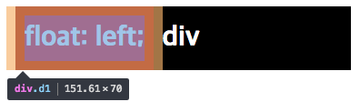
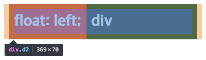
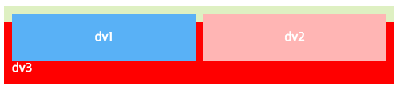
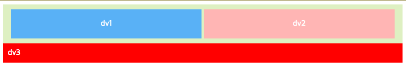
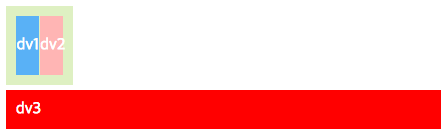

# ***Float***
float 속성(property)은 레이아웃을 잡는데 핵심이 되는 기술이다. float은 본래 이미지와 텍스트가 같이 있을 때, 이미지 주위를 텍스트로 감싸기 위해 만들어졌다. float은 부유한다는 의미처럼, 요소(element)의 기본적인 레이아웃의 흐름에서 벗어나서 다음 요소 위를 둥둥 떠있게 된다.  


|Value|Description|
|:---|:--------|
|none | 요소가 떠 있지 않게 한다. (기본값)|
|left | 요소가 블록의 좌측에 떠 있게 한다.|
|right| 요소가 블록의 우측에 떠 있게 한다.|


<br>

### 1. 정렬
float을 사용하지 않은 블록 요소들은 기본적으로 수직 정렬 이다. float을 사용하면 수평 정렬이 된다. float 프로퍼티를 사용하면 해당 요소가 붕 뜨면서 레이아웃 상의 일반적인 흐름(normal flow)에서 빠지게 된다. float에 의해 부동된 요소는 그를 둘러싸고 있는 container의 가장자리 또는 다른 부동 요소에 닿을 때까지 좌/우로 이동한다.  

아래 이미지에 빨간색 사각형 세 개가 있다. 왼쪽으로 두 개의 사각형이, 오른쪽으로 한개의 사각형이 부동 요소로 자리하고 있다. 왼쪽 두 번째 사각형은 첫번째 사각형에 이어 추가된 요소이다. 즉, 왼쪽으로 위치하되, **이미 존재하는(먼저 선언된) 다른 부동 요소의 자리를 침범하지 않고, 그 옆(오른쪽)으로** 놓인 것이다. 만약 여기서 ```float:right;``` 속성을 가진 요소를 추가한다면, 오른쪽에서 두번째로, 즉 오른쪽 사각형의 왼쪽으로 자리하게 될 것이다.


> float 프로퍼티는 좌, 우측 정렬만 할 수 있다.  
> 중앙 정렬은 margin 프로퍼티를 사용해야 한다.

```html
<!DOCTYPE html>
<html>
<head>
  <style>
    div {
      color: white;
      font-weight: bold;
      font-size: 30px;
      line-height: 50px;
      height: 50px;
      margin: 0 10px;
      padding: 10px;
    }
    .d1 {
      float: left;
      background: red;
    }
    .d2 {
      background: orange;
    }
  </style>
</head>
<body>
  <div class="d1"> float: left; </div>
  <div class="d2"> div </div>
</body>
</html>
```


***block 요소에 float을 선언하면 요소의 width는 자동 조정된다.***  
위 예제에서 d1 클래스 요소에는 float:left를 선언하였고 d2 클래스 요소에는 float를 선언하지 않았다. 이때 d1 클래스 요소는 width가 컨텐츠(내용, "float: left;")에 맞게 최소화되고, 다음 요소인 d2 클래스 요소 위에 떠 있게 된다.  

> **width 프로퍼티의 기본 값은 100%이다.** width 프로퍼티 값을 지정하지 않은 상태에서 block레벨 요소는 부모 요소의 가로폭을 가득(100%) 채운다. 따라서 예제의 d2는 100%의 너비를 가진 상태이다.




여기서 주목할 것은 d2 클래스 요소의 width는 d1클래스 요소가 차지한 width만큼 줄어들지 않았다는 점이다. 위 이미지에서 확인할 수 있듯 d2는 **float선언을 하지 않았기 때문에 100%의 너비를 유지**한다. 즉, d2가 아래에 깔려있고, 그 위로 d1이 둥둥 떠있는 형상이다.

<br>

### 2. float 프로퍼티 관련 문제 해결 방법
#### 1) float이 선언된 요소와 선언되지 않은 요소간 margin이 사라지는 문제

위 예제 이미지를 다시 보면, d1 요소가 d2 위에 떠 있는 상태이기 때문에, 두 요소간의 margin이 본래 의도한대로 표현되지 않았다. 코드상으로 두 요소 각각 margin이 상하 0px, 좌우 10px씩 선언되었고, 실제로 그렇게 들어간 것을 확인할 수 있다. (이미지에 양 옆으로 붙어있는 반투명한 주황색이 마진의 영역이다.) 다만, 문제는 마진이 없는 것처럼 보인다는 것이다.  
이는 d2에 float을 선언하지 않았기 때문에 발생하는 박스모델상의 문제이다.

**Solution**

---
***1) ```overflow: hidden;```***  
가장 쉬운 해법은 d2 요소에 위 프로퍼티를 선언하는 것이다. 이 프로퍼티는 자식 요소가 부모 요소의 영역보다 클 경우 넘치는 부분을 보이지 않게 해주는 역할을 하는데, 여기서는 float이 없어 제대로 표현되지 못하는 요소를 제대로 출력해준다.

```css
.d2 {
  overflow: hidden;
  background: orange;
}
```


***2) ```float:left;```***  
또 다른 방법은 d2 요소에도 d1과 같은 방향으로 float을 주는 것이다. 다만, 이 경우에는 d2가 본래의 width(100%)를 유지하지 못한다. 반드시 본래의 너비를 유지해야 한다면 위 방법이 더 유용하다.

```css
.d2 {
  float: left;
  background: orange;
}
```


---


### 2) float을 가진 자식 요소를 포함하는 부모 요소의 높이가 정상적으로 반영되지 않는 문제

```html
<!DOCTYPE html>
<html>
<head>
  <style>
    .wrap {
      color: white;
      text-align: center;
      padding: 10px;
      background-color: #def0c2;
    }
    .d1 {
      float: left;
      width: 49%;
      margin-right: 2%;
      padding: 20px 0;
      background-color: #59b1f6;
    }
    .d2 {
      float: left;
      width: 49%;
      padding: 20px 0;
      background-color: #ffb5b4;
    }
  </style>
</head>
<body>
  <div class="wrap">
    <div class="d1">dv1</div>
    <div class="d2">dv2</div>
  </div>
  <div style="background:red;padding:10px;color:white;">dv3</div>
</body>
</html>
```



예제의 dv1 요소와 dv2요소는 ```float:left;``` 선언되었으며, wrap(이미지의 연두색 부분)의 자식 요소이다. 본래 heigth는 특정 사이즈가 지정되지 않은 경우 콘텐츠의 사이즈만큼 자동 조정된다. 예제 코드에서 wrap의 heigth는 값이 지정되지 않았다. 그렇다면 자식 요소들의 콘텐츠에 맞게 높이가 자동으로 조정되어야 하는데, 실제로는 그보다 현저히 작게 표현되었다.  
float는 앞에서 언급했듯, 일반적인 흐름(normal flow)상에 존재하지 않는다. 따라서 float 요소의 높이를 알 수가 없다. 게다가 부모요소 이후에 위치하는 dv3 요소의 정렬에까지 문제를 발생시킨다.

> float는 본래 뒤에 오는 요소 위에 떠있도록 하게 하기 위한 프로퍼티이다. 따라서 float 요소의 너비나 높이는 계산 하지 못한다.

<br>

**Solution**

---

**1) ```overflow: hidden;```**  
가장 쉬운 해법은 부모 요소(wrap)에 ```overflow: hidden``` 프로퍼티를 선언하는 것이다. 하지만 이 방법은 부수 효과(부작용, side effect)이 있을 수 있어 권장되는 방법은 아니다.

```css
.wrap {
  ...
  overflow: hidden;
}
```

**2) ```clear: both;```**  
wrap 영역이 끝나기 직전에 빈 요소를 만들고, 빈 요소에 ```clear:both;```를 부여하여 부모 요소가 자식 요소의 높이를 인식하도록 만드는 방법이다. 

 ***```clear``` 프로퍼티**  
 float을 지워준다.  

|Value|Description|
|:---|:--------|
|left | 왼쪽 float을 지워준다.|
|right | 오른쪽 float을 지워준다.|
|both| 양쪽 float을 지워준다. |

이 방법을 적용하기 위해서는 **의미 없는 빈 요소**를 만들어야 하므로 그다지 좋은 방법은 아니다.  
```html
<!DOCTYPE html>
<html>
<head>
  <style>
    .wrap {
      color: white;
      text-align: center;
      padding: 10px;
      background-color: #def0c2;
    }
    .d1 {
      float: left;
      width: 49%;
      margin-right: 2%;
      padding: 20px 0;
      background-color: #59b1f6;
    }
    .d2 {
      float: left;
      width: 49%;
      padding: 20px 0;
      background-color: #ffb5b4;
    }
    .clear {
      height: 0;
      clear: both;
    }
  </style>
</head>
<body>
  <div class="wrap">
    <div class="d1">dv1</div>
    <div class="d2">dv2</div>
    <div class="clear"></div>
    <!-- clear처럼 의미없는 빈 요소가 들어간다. -->
  </div>
  <div style="background:red; padding:10px; color:white;">dv3</div>
</body>
</html>
```

**3) ```::after``` 가상 요소 선택자**  

부모 요소의 클래스(wrap)에 ```:after``` 가상 요소 선택자를 주는 방법이다. ```:after```는 해당 요소의 바로 뒤에 이어서 content 프로퍼티 값(value)을 삽입해주는 기능을 한다.([가상요소선택자 :after](http://poiemaweb.com/css3-selector#pseudo-element-selector))  
예제에서는 부모요소 wrap 클래스 바로 뒤에 블록 요소로 ```clear:both;``를 주고, 덧붙일 내용(content)은 비워서 보이지 않게 했다. 2번째 방법처럼 빈 요소를 주지 않으면서 부모 요소가 자식 요소의 높이를 가늠할 수 있게 하는 좋은 방법이다.

>가상 요소 선택자는 CSS2 문법(:after)과 CSS3 문법(::after)이 있는데 IE8까지 지원하는 CSS2 문법을 사용하는 편이 좋다.

```html
<!DOCTYPE html>
<html>
<head>
  <style>
    .wrap {
      color: white;
      text-align: center;
      padding: 10px;
      background-color: #def0c2;
    }
    .wrap:after {
      content: "";
      display: block;
      clear: both;
    }
    .d1 {
      float: left;
      width: 49%;
      margin-right: 2%;
      padding: 20px 0;
      background-color: #59b1f6;
    }
    .d2 {
      float: left;
      width: 49%;
      padding: 20px 0;
      background-color: #ffb5b4;
    }
  </style>
</head>
<body>
  <div class="wrap">
    <div class="d1">dv1</div>
    <div class="d2">dv2</div>
  </div>
  <div style="background:red;padding:10px;color:white;">dv3</div>
</body>
</html>
```

*****4) ```.clearfix:after```***  
3번 방법에서 발전된 형태의 해법으로 가장 추천되는 방식이다. clearfix 클래스를 선언하고, css상에서 3번과 동일한 프로퍼티를 추가한 :after를 선언한다. 그리고 clear가 필요한 요소에 clearfix 클래스만 추가해주면 된다.
의미 없는 빈 요소를 추가로 만들 필요가 없으며 앞선 방식(3번 :after방식)과 비교했을 때, 코드의 재사용이 가능하기 때문에 가장 깔끔하고 간편한 방식이다.

```html
<!DOCTYPE html>
<html>
<head>
  <style>
    .wrap {
      color: white;
      text-align: center;
      padding: 10px;
      background-color: #def0c2;
      /*overflow: hidden;*/
    }
    .clearfix:after {
      content: "";
      display: block;
      clear: both;
    }
    .d1 {
      float: left;
      width: 49%;
      margin-right: 2%;
      padding: 20px 0;
      background-color: #59b1f6;
    }
    .d2 {
      float: left;
      width: 49%;
      padding: 20px 0;
      background-color: #ffb5b4;
    }
  </style>
</head>
<body>
  <div class="wrap clearfix">
    <div class="d1">dv1</div>
    <div class="d2">dv2</div>
  </div>
  <div style="background:red;padding:10px;color:white;">dv3</div>
</body>
</html>
```
> [clearfix reference](https://stackoverflow.com/questions/211383/what-methods-of-clearfix-can-i-use)

**5) ```display: inline-block;```**  
자식 요소의 ```float``` 속성을 ```display: inline-block```으로 모두 대체하는 방법이다. 여기서도 inline-block 프로퍼티 요소의 연속 사용에 의해 자식 요소 각각에 정의하지 않은 4px의 space가 자동 지정된다는 점에 유의해야 한다.  

```html
<!DOCTYPE html>
<html>
<head>
  <style>
    .wrap {
      color: white;
      text-align: center;
      padding: 10px;
      background-color: #def0c2;
    }
    .d1 {
      /* float: left; */
      display: inline-block;
      width: 49%;
      /* margin-right: 2%; */
      padding: 20px 0;
      background-color: #59b1f6;
    }
    .d2 {
      /* float: left; */
      display: inline-block;
      width: 49%;
      padding: 20px 0;
      background-color: #ffb5b4;
    }
  </style>
</head>
<body>
  <div class="wrap">
    <div class="d1">dv1</div>
    <div class="d2">dv2</div>
  </div>
  <div style="background:red;padding:10px;color:white;">dv3</div>
</body>
</html>
```
> 연속된 inline-block에 발생한 공백을 제거하고자 한다면, 해당 요소에 **-4px의 마진 속성**을 주면 간단히 해결된다.  
> 이외 더 다양한 방법은 [Fighting the Space Between Inline Block Elements](https://css-tricks.com/fighting-the-space-between-inline-block-elements/)를 참고한다.

위에서 제시된 네 가지 방법 모두 문제를 해결할 수 있으며, 아래와 같은 결과물을 얻을 수 있다.


---

## **Q&A**

Q. ```overflow: hidden;```이 어떤 원리로 float을 clear하는지?  
A. ```overflow: hidden```은 박스(box) 밖으로 넘친(overflow) 내용물을 감추는(hidden) 기능을 하는 프로퍼티이다. 그런데 이 효과는 박스의 크기(width, height)를 명확하게 지정했을 경우에만 나타난다. **만약 width만 지정된 상태에서 이를 적용하면, 박스가 내용물의 크기만큼 아래로 늘어난다.** 이 때 박스 안에 있는 float된 요소의 높이까지 계산된다. 결국 박스가 float된 요소를 포함할 만큼 커지기 때문에 float을 제거하는 것(clear 속성)과 동일한 효과가 나타나게 되는 것이다. *[참고](http://blog.wystan.net/2007/08/26/clearing-float-method), 
[참고2](http://blog.wystan.net/2008/09/11/css-overflow-clearing-float)

<!-- 
Q. ```overflow:hidden;```방식의 side effect가 무엇인지?  
A. -->

Q+A.마지막 5번 방법에서 들었던 의문점이 있는데, 참고했던 블로그에서 ```inlin-block```이 ```float```을 해제하는 방법으로 부모 요소에 ```display: inline-block;``` 속성을 부여하는 방법을 제시했다. ```inline-block``` 속성이 부여된 요소는 ```float```된 자식의 높이만큼 늘어나며 ```float```을 해제하는 작용을 한다고 한다. 실제로 적용해보니, 높이는 늘어났지만, 의도했던 레이아웃이 아니었다.



[검색해본 결과](http://blog.hivelab.co.kr/2%ED%8C%80-hcrp-%EC%9C%A0%EB%8F%99%EC%A0%81%EC%9D%B8-blockdiv%EC%9A%94%EC%86%8C-%EA%B0%80%EC%9A%B4%EB%8D%B0-%EC%A0%95%EB%A0%AC%ED%95%98%EA%B8%B0/) 네비게이션에서 이런 방식으로 정렬하기도 하나보다. 별로 좋은 방법은 아닌 것 같다.
```html
<html>
<head>
  <style>
  .navigaion{
  text-align: center;
  }

  .navigation > ul{
    display:inline-block;
    list-style:none;
  }

  .navigation > ul > li{
    float: left;
    padding: 10px;
  }

  </style>
</head>
<body>
  <div class="navigation">
    <ul>
      <li style="background-color:#59b1f;">1st</li>
      <li style="background-color: pink;">2nd</li>
      <li style="background-color:#eee;">3rd</li>
      <li style="background-color:#aaa;">4th</li>
    </ul>
  </div>
  <div style="background:red;padding:10px;color:white;">dv3</div>
</body>
</html>
```


[참고]  
* [MDN korea](https://developer.mozilla.org/ko/docs/Web/CSS/float)
* [Poiema Web](https://poiemaweb.com)
* [Blog](http://naradesign.net/wp/2008/05/27/144/)
* [overflow: hidden;](http://blog.wystan.net/2007/08/26/clearing-float-method)