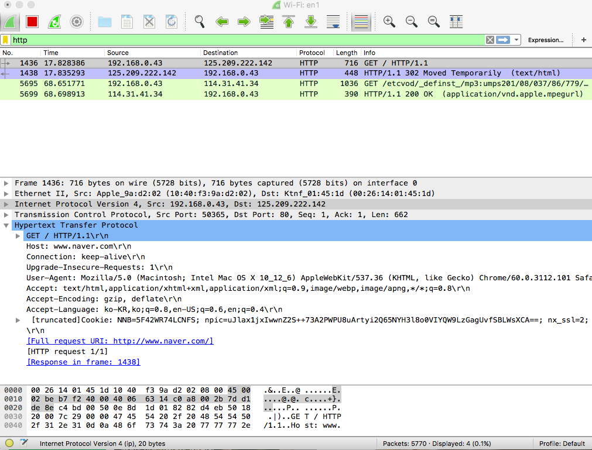
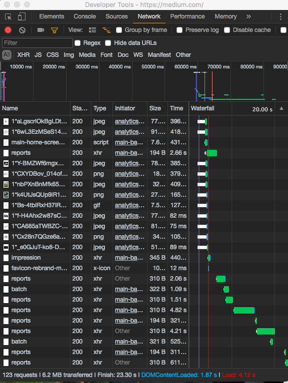
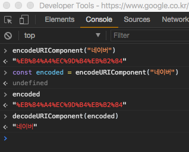

# HTTP

## 네트워크 확인하기

### 1) wireshark




### 2) 크롬 개발자도구



<br>

## HTTP


* 웹 브라우저와 웹 서버 간의 통신을 위해 개발된 통신규약
* 최근에는 REST API의 부상와 함께 다른 용도로도 널리 사용된다.
  * 모바일 앱 - 서버 간 통신
  * 서버 - 서버 간 통신
* 80번 포트를 기본으로 사용
* 클라이언트의 요청(request)과 서버의 응답(response)으로 이루어진다.

### 1) http의 역사
**1991**  
HTTP 초기버전 발표. 텍스트만 전송할 수 있는 극도로 단순한 프로토콜. 1990년대 초 인터넷 붐을 일으킴

**1996**  
여러 인터넷 서비스 업체들이 자체적으로 사용하던 HTTP 구현들을 모아 HTTP 1.0 발표

**1999**  
1.0의 문제를 해결하고 여러가지 기능을 추가한 HTTP 1.1을 발표. 지금까지 사용되고 있는 버전

<br>

### 2) HTTPS


* HTTP over SSL
* HTTP 통신을 암호화해 주고 받는 내용을 중간에서 가로챌 수 없도록 한다.
* 443번 포트를 기본으로 사용한다.


### 3) HTTP/2
* 구글의 [SPDY](http://d2.naver.com/helloworld/140351) 프로토콜을 기반으로 2015년에 확정된 새로운 HTTP 표준
* 0,1만으로 통신하는 프로토콜로 더이상 텍스트 기반이 아님
* 오로지 **속도 개선**에 중점을 두고 개발됨
* 반드시 HTTPS를 사용해야 함
* [현재 전체 웹사이트 중 16% 이상이 사용중](https://w3techs.com/technologies/details/ce-http2/all/all)

## HTTP 작동방식 

### 1) Request & Response
* 요청 Request: 웹 브라우저(또는 다른 클라이언트)는 웹 서버에 요청(request)를 보냄
* 응답 Response: 그에 따라 서버는 클라이언트에 응답(response)를 보냄
* 웹 브라우저의 경우, HTML 문서 형태의 응답이 오면 해당 문서를 분석한 후, 문서에 포함된 모든 자원에 대한 요청을 각각 추가로 보냄 (이미지, 동영상, 오디오, CSS, JS, 폰트, ...)

### 2) Request Methods

* [HTTP 명세](https://developer.mozilla.org/ko/docs/Web/HTTP/Methods)에는 8 종류가 등록되어 있고, 각각의 역할과 충족해야 하는 성질이 명시되어 있음
* 웹 브라우저는 **특정 상황에서 특정 메소드로 요청을 보내도록** 만들어져 있음
* Ajax와 같이 **요청을 보내는 코드를 직접 짤 때**는 요청 메소드를 선택할 수 있음
* **자료의 본문을 요청하는 GET 메소드**와, 새로운 **자료를 등록하는 POST 메소드**가 가장 많이 쓰임

웹 브라우저는 순수 HTML만으로는 GET과 POST 메소드만 사용할 수 있도록 강제하고 있다. AJAX등으로 코드를 직접 작성할 때에는 메소드를 자유롭게 선택하여 사용할 수 있다.

### 서버가 충족시켜야하는 메소드의 성질

* Safe  

요청이 서버의 상태에 영향을 미치지 않아야 함. 즉, **읽기 전용**이어야 함이 표준에 명시되어 있다.

* Idempotent  

여러 번 같은 요청을 해도 한 번 요청한 것과 같은 효과여야 함. **네트워크가 불안정해도 안전하게 요청을 보낼 수 있음**

> DELETE, GET은 Idempotent을 만족해야 한다. 게시글의 삭제 요청을 여러번 보내도 한 번의 삭제 작업이 이루어져야 한다. GET도 마찬가지로, 여러번 요청이 가도 한 번만 GET 작업을 해야한다.

> POST는 데이터를 서버로 보내는 방법이다. 자료를 새로 만들 때 사용된다. 게시물을 만드는 요청을 서버에 보내다가 네트워크가 끊어진 상황을 가정했을 때, 서버에는 이미 해당 데이터가 만들어졌으므로 이후 같은 요청을 보내면 에러가 나야 한다. 따라서 POST는 Idempotent를 만족시켜서는 안 된다.

* Cacheable  

(특정 조건을 만족하면) 응답을 클라이언트에 저장해두었다가 다음 번 요청 때 **다시 쓸 수 있음**  

<br>

### 3) URL


---

<서버의 위치>

1. 스키마

2. 서브 도메인

3. 도메인

4. 탑레벨 도메인

5. 포트

---

<서버에서 얻고자 하는 자원의 위치>

6. 경로(path)

7. 쿼리 스트링 

8. 해시 (fragment identifier)

### 4) Percent Encoding

* URL은 ASCII 문자(128개의 영문자+특수문자+제어문자)밖에 사용하지 못하기 때문에, non-ASCII 문자를 위한 표현방법이 필요함 #

* Percent encoding은 non-ASCII 문자를 위한 웹 표준 인코딩 방법으로, JavaScript에 관련 기능이 포함되어 있음

```
> encodeURIComponent("한글")
"%ED%95%9C%EA%B8%80"
> decodeURIComponent("%ED%95%9C%EA%B8%80")
"한글"
```




### 5) Request Target

일반적인 경우 아래와 같은 구조가 사용됨  

`absolute path + query string + fragment id`

절대 경로 + 쿼리스트링 + 해시  

`GET /path/to/resource?foo=bar&spam=hoge#fragid HTTP/1.1`


### 6) Response Status

응답의 성공, 실패 여부와 종류를 나타내며, [상태 코드](https://httpstatuses.com/) + 상태 메시지의 형태로 응답에 포함됨

`HTTP/1.1 200 OK`

### [Status Category]

**2xx** 성공

  * 200 OK - 성공
  * 201 Created - 자료가 성공적으로 생성되었다.

**3xx** 추가 작업이 필요하다.

  * 301 Moved Permanently (Redirection) - 자료가 완전히 다른 곳으로 이동했다.
  * 302 Found (Redirection) - 자료가 일시적으로 다른 곳에 있다.
  * 304 Not Modified (Cache) - 클라이언트가 이미 가지고 있던 자료가 수정되지 않았다. (그대로 사용하면 된다.) CSS나 Javascript에 대한 응답인 경우가 많다.

**4xx** 실패 - 클라이언트 책임

  * 400 Bad Request - 요청의 형태가 잘못되어 응답할 수 없다.
  * 403 Forbidden - 요청한 자료에 접근할 권한이 없다.
  * 404 Not Found - 요청한 자료가 없다.

**5xx** 실패 - 서버 책임

  * 500 Internal Server Error - 요청을 처리하던 중에 예상치 못한 요류가 발생했다.
  * 503 Service Unavailable - 서버가 일시적으로 응답을 할 수 없다.

### 7) Header

  * 요청과 응답에 대한 추가 정보를 표현하는 데 사용
  * 인증, 캐싱, 쿠키, 보안, 내용협상, 프록시 등 웹 표준에 정의된 많은 기능을 제어하는 데 사용됨

  * **Authorization**  
    요청의 인증 정보
  * **User-Agent**  
    요청 중인 클라이언트의 정보
  * **Location**  
    301, 302 응답에서 자료의 위치
  * **Accept**  
    요청이 어떤 형태의 자료를 원하는지 나타냄
  * **Content-Type**  
    요청 혹은 응답이 어떤 형태의 자료인지 나타냄

### 8) Content Negotiation

요청의 Accept, Accept-Language 등의 헤더를 보고 서버가 그에 맞는 형태의 자료를 응답하는 절차를 content negotiation(내용 협상)이라고 함


클라이언트가 JSON이 필요하다는 요청을 보내면, 서버가 JSON포맷의 데이터를 보내준다. 만약 없다면 XML 또는 기타 다른 포맷의 데이터를 대신 보내주는데, 이 과정을 content negotiation: 내용 협상이라고 한다.