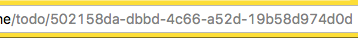

# HTML Form

## 1. 기본 동작

HTML form을 전송하면, 입력된 정보가 기본적으로 percent encoding 되어 요청됨

* GET method

```
GET /search?query=%EA%B0%9C&sort=latest HTTP/1.1
...
```

* POST method

```
POST /form HTTP/1.1
Content-Type: application/x-www-form-urlencoded
...

home=Cosby&favorite+flavor=flies
```

<br>

## 2. multipart/form-data

* 기본 설정(percent encoding)으로는 폼으로 파일을 업로드하는 것은 불가능
* (클라이언트 측) form 태그에 enctype="multipart/form-data" 속성을 적용하면 파일 업로드 가능
* (서버 측) body-parser 미들웨어는 multipart/form-data 형태의 요청을 지원하지 않음 ([multer](https://www.npmjs.com/package/multer) 필요)

<br>

## 3.  예제

[code](https://glitch.com/edit/#!/reflective-aries?path=server.js:44:45)

* UUID (Universally unique identifier)
  - 유효ID = 범용 고유 식별자

  

  인터넷 상의 수많은 자료를 구분하기 위해 각 자료에 식별자(identifier)를 부여하는 일은 아주 중요합니다. 식별자를 부여하는 가장 쉬운 방법은 자료가 생성된 순서대로 번호를 붙이는 것입니다. 실제로 많은 데이터베이스에서 이런 방법을 사용하고 있습니다. 하지만 환경에 따라 자료가 생성되는 순서를 알 수 없는 경우도 있습니다.  

  UUID는 식별자로 사용하기 위해 고안된 수 형식이며, 아래와 같은 형식으로 표현됩니다.  

  424e19f5-f330-4be1-889f-4a9f7da75b69  

  UUID는 표현할 수 있는 경우의 수가 무지무지무지무지 많습니다. (128bit = 2의 128제곱) UUID 난수를 생성하는 표준적인 방법(UUID version 4)을 사용하면, 언제 어디서 UUID를 생성해도 정확히 같은 UUID가 생성될 수 있는 확률이 매우매우매우매우 작기 때문에 안심하고 식별자로 사용할 수 있습니다.  

  node에서의 uuid는 [npm uuid package](https://www.npmjs.com/package/uuid) 설치를 통해 사용할 수 있다.  

* Redirection after submission  
브라우저의 새로고침은 동일한 요청을 한번 더 보내는 것이다.  
redirect를 하지 않으면 POST가 같은 요청을 또 보내기 때문에, 새로고침시 이전에 보냈던 요청을 한번 더 보내게 된다. 따라서 POST에 대해서는 redirect 하지 않으면 문제가 발생한다.  

  ```js

  // 할일 추가 endpoint
  app.post('/todo', urlencodedParser, (req, res) => {
    const title = req.body.title
    // validation 유효성 검사 : title이 빈 문자열인지 확인
    if (title && title.length!==0) {
      const todo = {
        id: uuidv4(), // slug
        title // es6문법
      }
      todos.push(todo)
      // redirect 하지 않으면 새로고침시 동일 요청을 한번 더 보낸다.
      res.render('index.ejs', {todos}) // 이렇게 하면 안 됩니다!
      // res.redirect(301, '/') // 이렇게 해도 안 됩니다!
      // res.redirect('/') // res.redirect는 302 상태코드로 응답합니다.
    } else {
      res.status(400)
      res.send('400 Bad Request')
    }
  })

  ```

  순수 HTML form으로 요청을 보낼 때는 반드시 redirect를 해야 한다.  
  (AJAX로 하는 경우에는 요청을 새로 또 보내지 않으니, 굳이 하지 않아도 됨!)  


  ```js

  // 할일 추가 endpoint
  app.post('/todo', urlencodedParser, (req, res) => {
    const title = req.body.title
    // validation 유효성 검사 : title이 빈 문자열인지 확인
    if (title && title.length!==0) {
      const todo = {
        id: uuidv4(), // slug
        title // es6문법
      }
      todos.push(todo)
      //res.render('index.ejs', {todos}) // 이렇게 하면 안 됩니다!
      res.redirect(301, '/') // 이렇게 해도 안 됩니다!
      // res.redirect('/') // res.redirect는 302 상태코드로 응답합니다.
    } else {
      res.status(400)
      res.send('400 Bad Request')
    }
  })

  ```
  #### # 301 vs 302

  서버가 301응답을 보내면 웹 브라우저는 그것을 기억해뒀다가 똑같은 요청이 왔을 때 서버에 요청을 보내지 않고 브라우저에 저장해두었던 redirect 정보를 가지고 redirect를 한다. 즉 서버에 재요청하지 않고 웹브라우저에 기억해둔 정보를 꺼내와서 사용한다. 웹브라우저 주소가 완전히 이동했을 때, (사이트가 폐쇄된 경우 등) 301을 사용한다. (부수 효과: 검색엔진의 웹 크롤러는 301응답을 발견할 경우 그 사이트로 더이상 접근하지 않는다.)  

  반면 똑같은 요청이 와도 서버에 해당 요청을 한번 더 전송하는 것이 302 응답이다.  

* Form validation  

  사용자가 입력하는 자료는 개발자가 기대하는 형식과는 영 딴판일 수 있습니다. 필요한 필드가 없을 수도 있고, 자료의 형식을 서버가 이해할 수 없는 경우도 있습니다. 이런 자료를 데이터베이스에 그냥 집어넣게 되면 데이터베이스가 뒤죽박죽이 되고 말 것입니다. 그래서, 사용자에게 입력받은 자료는 처리를 하기 전에 항상 올바른 형태인지 검증해야 합니다. 이런 검증 과정을 form validation이라고 합니다.  

  form validation을 구현하는 전형적인 방법은 다음과 같습니다.  

  * 사용자가 폼을 작성합니다.  
  * 사용자가 폼을 서버에 전송합니다.
  * 서버는 기대한대로 데이터가 들어왔는지 검사합니다.
  * 서버는 데이터가 기대한 대로 잘 들어왔으면 다음 단계를 진행하고, 데이터에 문제가 있다면 어떤 문제가 있는지를 사용자에게 알려줍니다. (이 프로젝트에서는 데이터에 문제가 있으면 단순하게 400 Bad Request 응답을 하고 있지만 사용자 경험을 위해서는 이렇게 하면 안되겠죠?)  

  서버 측에서 하는 form validation은 꼭 필요하지만, 사용자가 자료를 서버에 전송해야만 데이터에 어떤 문제가 있는지를 알 수 있다는 단점이 있습니다. 사용자 입장에서는 실컷 폼을 다 작성해서 전송했더니 폼에 에러가 있다고 하며 중간 단계부터 다시 시작해야 하니 짜증이 날 것입니다. 아마 여러분도 비슷한 경험이 있을 것입니다.  

  서버 측 validation을 잘 구현해서 사용자가 덜 불편하게끔 만드는 방법도 있지만 폼을 서버에 전송해야 피드백을 받을 수 있다는 점은 변하지 않습니다. 더 나은 사용자 경험을 위해 클라이언트 측 validation을 하는 것을 고려해볼 수 있습니다.  

  클라이언트 측 validation은 사용자가 폼을 작성하는 도중에 피드백을 받을 수 있다는 점에서 서버 측 validation보다 훨씬 나은 사용자 경험을 제공할 수 있습니다. 대신 서버 측 코드에서 하는 데이터 검사 로직을 클라이언트 측 코드에도 중복 구현해야 한다는 어려운 점이 있습니다. 다행히 HTML5에 추가된 form validation 기능을 이용하면 간단한 validation은 자바스크립트 코드를 하나도 짜지 않고도 구현할 수 있습니다. HTML5 form validation을 시험해 보려면, index.ejs 파일의 title 필드에 required 속성을 추가해보세요.  

  HTML5 form validation은 사용하기 간편하고, 브라우저에 내장되어 있다는 점에서 (특히 모바일에서) 일관성있는 사용자 경험을 제공할 수 있다는 장점이 있습니다. 하지만 HTML5를 지원하지 않는 구형 브라우저에서는 사용할 수 없고, 또 복잡한 형태의 validation은 지원하지 않는다는 단점이 있습니다. (여러 필드의 자료를 합쳐서 validation을 한다거나, validation을 하기 위해 서버에 요청을 해야 하는 등)  

  주의! 클라이언트 측 validation을 하더라도 서버 측에서는 반드시 validation을 따로 해주어야 합니다. 사용자가 언제나 우리가 제공하는 클라이언트를 사용한다는 보장은 없기 때문입니다. (예를 들면 악의적인 해커가 Postman 등을 이용해 이상한 요청을 보낼 수도 있겠죠?)  