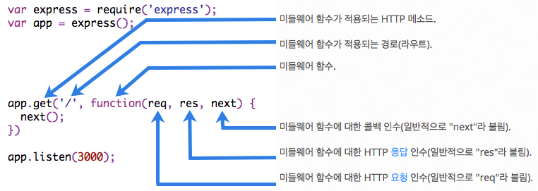

# Express Middleware

익스프레스는 개발자가 다양한 기능을 사용할 수 있도록 미리 만들어 둔 여러가지 미들웨어를 제공한다. npm을 통해서 다른 개발자들이 만든 미들웨어를 쉽게 다운 받아 사용할 수도 있다. 반대로 프로젝트 내에서 내가 직접 정의하고 로드(app.use)하여 사용하는 것도 가능하다.

미들웨어 함수는 '요청 오브젝트(req)'와 '응답 오브젝트(res)', 그리고 애플리케이션의 요청-응답 주기 중 '다음 미들웨어 함수(next)'에 대한 액세스 권한을 갖는 함수이다.



미들웨어는 인수로 요청 오브젝트(request 객체)와 응답 오브젝트(response 객체), next 함수를 인자로 받는다. 요청 오브젝트와 응답 오브젝트를 조작해서 기능을 구현하며, next 함수는 다음 미들웨어를 동작시키기 위해 사용되며, 인자 없이 호출된다.

미들웨어는 기본적으로 **함수**이다. 따라서 내부에서 **어떤 작업이든** 가능하다. 미들웨어 함수로 수행하는 일은 아래와 같다.

* 로깅
* HTTP body를 객체로 변환
* 사용자 인증
* 권한 관리 등

<br>

## app.use()

`app.use()`는 미들웨어 함수를 로드하기 위해 사용되는 메소드이다. 미들웨어 함수를 지정하고, `app.use()`를 통해 호출할 수 있다.

```js
//미들웨어 - 함수
function helloMiddleware(res, req, next) {
  console.log('hello');
  next();
}

app.use(helloMiddleware);
```

위 예제는 hello를 콘솔에 출력하는 helloMiddleware 함수를 정의하고, `app.use()`를 통해 로드하였다. 위와 같은 로드 방식은 앱 전체에서 동작하게 하는 방식이다. 첫번째 인자로 경로를 지정하면, 특정 경로에서만 동작하게 할 수도 있다. 아래 예제를 참고하자.


* 앱 전체에서 동작하게 하기

```js
app.use(helloMiddleware);
```

* 특정 경로에서만 동작하게 하기

```js
// some-path라는 경로 안에서만 동작하도록 로드
app.use('/some-path', helloMiddleware);
```

* 한 번에 여러 개 로드하기

```js
// 다수의 미들웨어를 한번에 호출
app.use(middleware1, middleware2, middleware3, ...)
```

## 호출 순서

미들웨어의 실행 순서는 호출 순서에 의해 결정된다. 즉, 먼저 호출되는 것이 먼저 실행된다.

```js
// mylogger.js

const express = require('express');

const app = express();

const myLogger = (req, res, next) => {
  console.log('LOGGED');
  next();
};

app.use(myLogger);

app.get('/', (req, res) => {
  res.send('Hello World');
});

app.listen(3000);
```

```js
// console
% node mylogger.js
LOGGED
```

위 예제는 라우팅 이전에 myLogger가 로드되었다. 실행하면 콘솔창에 LOGGED를 출력할 것이다.

그런데 만약 myLogger가 라우팅 이후에 로드되었다면?

```js
const express = require('express');

const app = express();

const myLogger = (req, res, next) => {
  console.log('LOGGED');
  next();
};

// 루트경로에 대한 라우팅
app.get('/', (req, res) => {
  res.send('Hello World');
});

// myLogger 미들웨어를 라우팅 이후에 로드하였다.
app.use(myLogger);

app.listen(3000);
```

이 경우, 루트 경로의 라우트 핸들러가 요청-응답 주기를 종료하므로 요청은 myLogger에 도달하지도 못한다. 따라서 LOGGED를 출력하지 않는다.

```js
// console
% node mylogger.js
// 아무것도 출력하지 않는다.
```

<br>

## 자주 사용되는 미들웨어

### 1. static 미들웨어

static 미들웨어는 특정 폴더의 파일들을 특정 패스로 접근할 수 있도록 만들어준다.

static 미들웨어는 외장 모듈로 만들어져 있기 때문에 npm을 통해 설치해야 한다. 터미널이나 명령 프롬프트(cmd)에서 아래 명령을 통해 설치한다.

```bash
$ npm install serve-static --save
```

아래는 static 사용의 예시이다. public 폴더에 있는 모든 파일을 웹 서버의 루트 패스로 접근할 수 있도록 하고 싶을 때 아래처럼 사용한다.

```js
const static = require('serve-static');

...

app.use(static(path.join(__dirname, 'public')));
```

이 코드는 public 폴더 안에 있는 파일들을 클라이언트에서 바로 접근할 수 있게 한다. 예를 들어 프로젝트 폴더 안에 다음과 같은 폴더나 파일이 들어 있다면,

```
ExpressExample/public/index.html
ExpressExample/public/house.png
ExpressExample/public/main.js
ExpressExample/public/style.css
```

웹 브라우저에서 다음과 같은 주소로 바로 접근할 수 있다.

```
http://localhost:3000/index.html
http://localhost:3000/house.png
http://localhost:3000/main.js
http://localhost:3000/style.css
```

만약 파일을 사이트의 /public 패스로 접근하게 만들고 싶다면 위의 코드에서 첫번째 인자에 요청 패스 `/public`을 추가해주면 된다.

```js
app.use('/public', static(path.join(__dirname, 'public')));
```
<sub> * __dirname: 현재 디렉토리</sub>

이렇게 하면 요청 패스와 특정 폴더(static 함수를 이용해 지정한 디렉터리)가 매핑(Mapping)되어 접근할 수 있게 된다.

### 2. body-parser

클라이언트의 요청(request) 방식에는 대표적으로 GET방식과 POST 방식이 있다.
GET 방식은 주소 문자열에 요청 파라미터가 들어가므로 url을 통해 확인이 가능하다. 그에 반해 POST 방식은 본문인 Body 영역에 요청 파라미터가 들어간다. 따라서 GET 방식과는 다른 방식으로 요청 파라미터를 파싱해야 한다.

`body-parser` 미들웨어는 POST 방식으로 요청할 때 body에 들어있는 요청 파라미터들을 파싱하여 request 객체의 body 속성에 넣어준다.

`body-parser` 미들웨어 역시 외부 모듈이므로, npm을 통해 다운로드해야 사용할 수 있다.

```bash
$ npm install body-parser --save
```

public 폴더 생성 후 그 안에login.html 파일을 생성한다.

```html
<!DOCTYPE html>
<html lang="en">
<head>
  <meta charset="UTF-8">
  <meta name="viewport" content="width=device-width, initial-scale=1.0">
  <meta http-equiv="X-UA-Compatible" content="ie=edge">
  <title>login test</title>
</head>
<body>
  <h1>로그인</h1>
  <form method="post">
    <table>
      <tr>
        <td><label>아이디</label></td>
        <td><input type="text" name="id"></td>
      </tr>
      <tr>
        <td><label>비밀번호</label></td>
        <td><input type="text" name = "password"></td>
      </tr>
    </table>
    <input type="submit" value="전송" name="">
  </form>
</body>
</html>
```

```js
// server.js

// Express 기본 모듈 불러오기
const express = require('express');
const http = require('http');
const path = require('path');

// Express의 미들웨어 불러오기
const bodyParser = require('body-parser');
const static = require('save-static');

// 익스프레스 객체 생성
const app = express();

// 기본 속성 설정
app.set('port', process.env.PORT || 3000);

// body-parser로 application/x-www-form-urlencoded 파싱
// .urlencoded() 메소드를 호출하면서 미들웨어를 설정하면, 'application/x-www-form-urlencoded' 형식으로 전달된 요청 파라미터를 파싱할 수 있다.
// 이 형식은 일반적인 요청 파라미터의 형식이다.
app.use(bodyParser.urlencoded({ extended: false }));

// body-parser를 사용해 application/json 파싱
// .json() 메소드를 호출하면서 미들웨어를 설정하면 application/json 형식으로 전달된 요청 파라미터를 참조할 수 있다.
app.use(bodyParser.json());

app.use(static(path.join(__dirname, 'public')));

// 미들웨어에서 파라미터 확인
app.use((req, res, next) => {
  console.log('첫번째 미들웨어에서 요청을 처리');

  // body 안에 있는 요청 파라미터를 참조한다.
  // 만약 클라이언트가 요청하는 방식이 GET 방식인지 POST 방식으로 요청할지 모른다면
  // 두 가지 경우를 모두 고려해 두 가지 요청 파라미터를 모두 검사한다.
  const paramId = req.body.id || req.query.id;
  const paramPassword = req.body.password || req.query.password;

  res.writeHead('200', {'Content-Type':'text/html;charset=utf-8'});
  res.write('<h1>Express 서버에 응답한 결과입니다. </h1>');
  res.write('<div><p>Param id: '+ paramId + '</p></div>');
  res.write('<div><p>Param password: ' + paramPassword + '</p></div>');
  res.end();
});
```

```bash
$ node server.js
```

```
http://localhost:3000/login.html 접속
```

서버 코드에서 use() 메소드로 설정한 함수는 login.html 문서에 접근할 때는 호출되지 않는다. 처음에는 login.html 문서가 웹 브라우저에 보이고, 전송 버튼을 클릭해 POST로 요청했을 때 use() 메소드로 설정한 함수가 호출된다.

전송 버튼을 누르면 POST 방식으로 요청을 보낼 때도 GET 방식과 마찬가지로 요청 파라미터를 확인할 수 있다.  

<br>

## Middleware를 사용하는 이유

미들웨어로 할 수 있는 모든 일은 사실 라우트 핸들러에서도 할 수 있다. 그럼에도 미들웨어를 사용하는 이유는 여러 라우터에서 사용해야 하는 기능을 중복 작성하는 불편을 덜고, **코드를 재사용**하기 위함이다.

## Middleware 생태계

[Express resource](https://expressjs.com/ko/resources/middleware.html)
[NPM search](https://www.npmjs.com/search?q=express+middleware)

## 미들웨어 예제

middlewares.js 파일에서 작성한 미들웨어를 server.js에서 불러와 사용하고 있다. 각각 어떤 방식으로 미들웨어를 사용하고 있는지 확인해보자.

```js
// middlewares.js
exports.ipLoggingMiddleware = (req, res, next) => {
  console.log(`request ip: ${req.ip}`)
  next()
}

exports.urlLoggingMiddleware = (req, res, next) => {
  console.log(`request url: ${req.originalUrl}`)
  next()
}

exports.resLocalMiddleware = (req, res, next) => {
  res.locals.myVar = 'FASTCAMPUS!'
  next()
}

exports.lock = key => (req, res, next) => {
  if (req.query.key === key) {
    next()
  } else {
    res.status(403)
    res.send('403 Forbidden')
  }
}
```

```js
// server.js
const express = require('express')
const {
  ipLoggingMiddleware, 
  urlLoggingMiddleware, 
  resLocalMiddleware,
  lock
} = require('./middlewares')

const app = express()

app.set('view engine', 'ejs')

// 앱 단위 미들웨어는 모든 라우트 핸들러에서 실행됩니다.
// 미들웨어는 등록된 순서대로 실행됩니다.
// 아래 미들웨어 적용 순서를 바꿔보세요.
app.use(urlLoggingMiddleware)
app.use(ipLoggingMiddleware)


// 라우트 단위 미들웨어는 적용된 라우트에서만 실행됩니다.
app.get('/', resLocalMiddleware, (req, res) => {
  res.render('index.ejs')
})

app.get('/secret', lock('thisisthekey'), (req, res) => {
  res.send('my secret is...')
})

app.listen(3000, function() {
  console.log('listening...')
})
```

```js
// views/index.ejs
<!DOCTYPE html>
<html>
  <head>
  </head>
  <body>
    <div>
      <%= myVar %>
    </div>
  </body>
</html>
```

**next**

미들웨어는 `req`, `res`에 더해서 `next`라는 함수를 추가로 인자로 받는다. `next` 함수를 호출하면 다음 미들웨어로 처리를 넘기는 효과가 있다. 만약에 미들웨어가 `next` 함수를 호출하지도 않고, 응답도 보내지 않으면 클라이언트는 응답을 받지 못하게 된다.

**App Local, Response Local**

`app.locals`와 `res.locals`는 특별한 객체를 담고 있다. 템플릿에서는 `res.render`를 통해 명시적으로 주입받지 않아도 저 두 객체의 속성에 바로 접근할 수 있다.

템플릿을 가리지 않고 사용되는 정보들, 예를 들어 '현재 로그인 중인 사용자 정보' 같은 것을 `res.render`에 매번 인자로 넘기는 것은 귀찮을 뿐더러 빠뜨리기도 쉽다. 그런 정보들을 템플릿에서 쉽게 사용하기 위해 `app.locals`나 `res.locals`에 우리가 원하는 이름으로 속성을 주입할 수 있습니다.

`app.locals`는 앱 단위로 공통적으로 쓰이는 정보를 담는 목적으로 사용된다. `res.locals`는 각 요청마다 달라지는 정보를 담는 목적으로 사용된다.

`app.local` 객체를 조작하는 것은 매우 쉽다. `res` 객체는 매 요청마다 새로 생성되어 미들웨어 바깥에서 접근할 수 있는 방법이 없으므로, `res.locals`를 조작하려면 미들웨어를 사용해야 한다.

## 미들웨어 VS 라우트 핸들러

라우트 핸들러도 미들웨어이다. 즉, next 함수를 인자로 받는 것이 가능하다.

```js
app.get('/', (req, res, next) => {
  if(!someCondition) {
    next(); // 요청을 처리하지 않고 다른 핸들러로 넘긴다.
  } else {
    res.send('hello');
  }
});
```

**Example: custom 404**

```js
// views/404.ejs
My Awesome 404!
```

```js
// 요청이 라우트 핸들러가 등록된 어떤 경로와도 일치하지 않을 때,
// 맨 마지막 미들웨어를 실행시킬 수 있습니다. 이를 이용해 우리만의 404 페이지를 보여줄 수 있습니다.
// [참고](http://expressjs.com/ko/starter/faq.html)
app.use((req, res, next) => {
  res.render('404.ejs')
})
```

## 오류처리 미들웨어

다른 미들웨어 함수와 정의하는 방법은 동일하지만, err라는 인수를 추가로 받는다는(총 4개의 인수) 차이가 있다.

```js
app.use((err, req, res, next) => {
  console.error(err.stack);
  res.status(500).send('Something broke!');
});
```

오류 처리 미들웨어는 다른 app.use() 및 라우트 호출을 정의한 후에 **마지막으로 정의**해야 한다.

```js
const bodyParser = require('body-parser');
const methodOverride = require('method-override');

app.use(bodyParser());
app.use(methodOverride());
app.use((err, req, res, next) => {
  // logic
});
```

미들웨어 함수 내부로부터의 응답은 HTML 오류 페이지, 단순 메시지, JSON 문자열 등으로, 클라이언트가 원하는 형식으로 설정할 수 있다.  

오류처리 미들웨어 함수 역시 일반적인 미들웨어 함수처럼 직접 정의할 수 있다. 아래는 XHR을 이용한 요청 및 그렇지 않은 요청에 대한 오류처리 미들웨어 함수를 정의한 예이다.

```js
const bodyParser = require('body-parser');
const methodOverride = require('method-override');

app.use(bodyParser());
app.use(methodOverride());
app.use(logErrors);
app.use(clientErrorHandler);
app.use(errorHandler);
```

logError는 요청 및 오류 정보를 stderr에 기록할 수 있다.

```js
// 오류정보를 기록하는 함수
function logErrors (err, req, res, next) {
  console.log(err.stack);
  next(err);
}
```

```js
// 오류인 경우 500 error를 보내고 아닌 경우 다음 오류처리 미들웨어로 넘기는 함수
function clientErrorHandler(err, req, res, next) {
  if(req.xhr) {
    res.status(500).send({ error: 'Something failed!'});
  } else {
    next(err);
  }
}
```
모든 오류를 처리하는(catch-all) errorHandler 함수는 다음과 같이 구현할 수 있다.

```js
function errorHandler(err, req, res, next) {
  res.status(500);
  res.render('error', { error: err });
}
```

---

[expressjs.com](http://expressjs.com/ko/guide/writing-middleware.html)

[expressjs.com - 오류처리 미들웨어](https://expressjs.com/ko/guide/error-handling.html)

[강사님 강의자료](seungha-kim.github.io)

[참고서적: Do it! Node.js 프로그래밍](http://www.easyspub.co.kr/20_Menu/BookView/A001/127/PUB)
